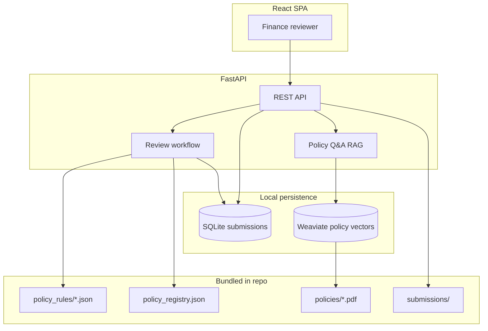
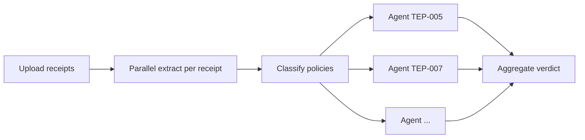
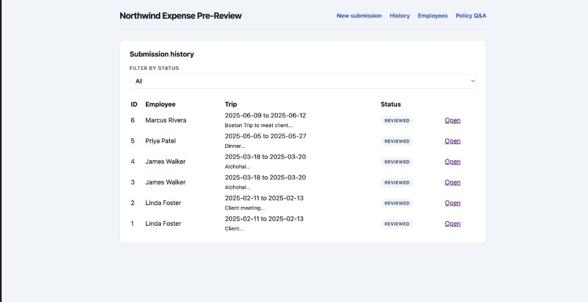
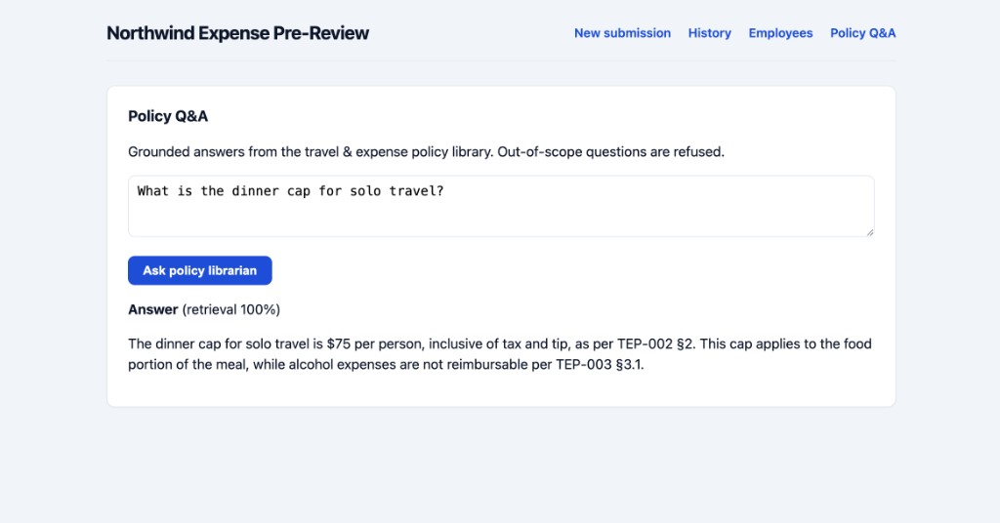
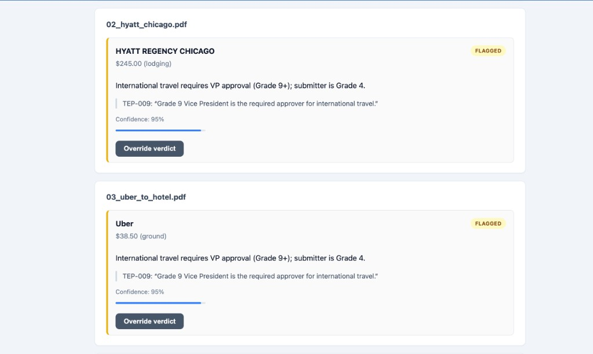
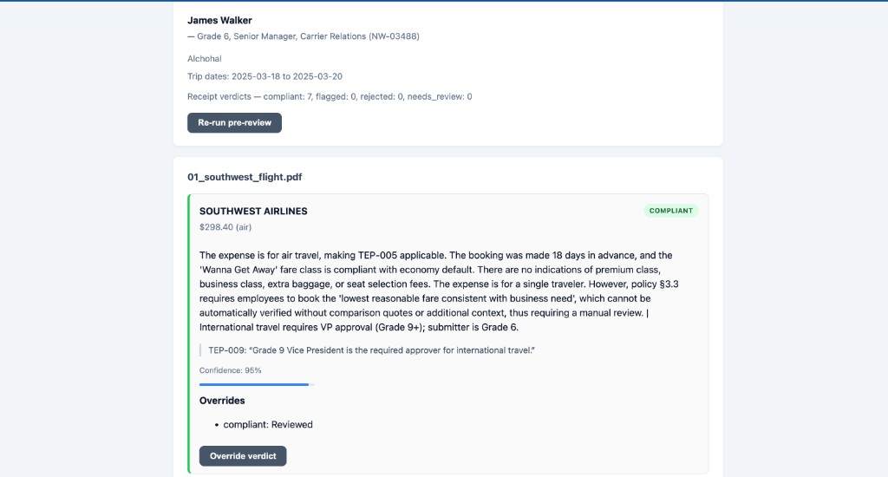
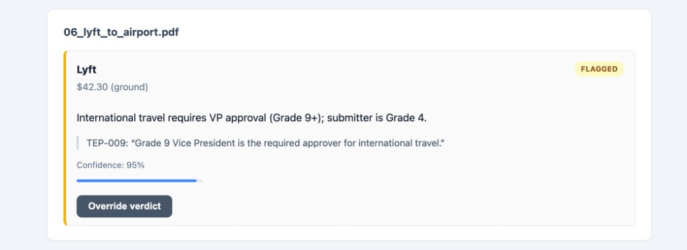
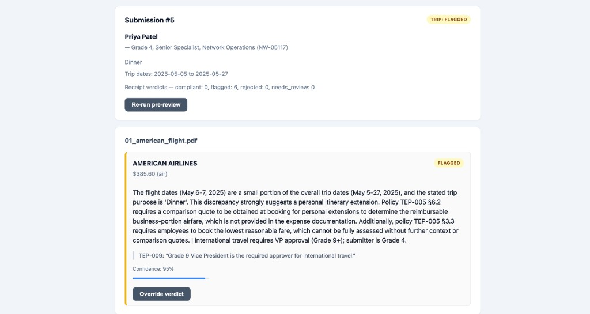
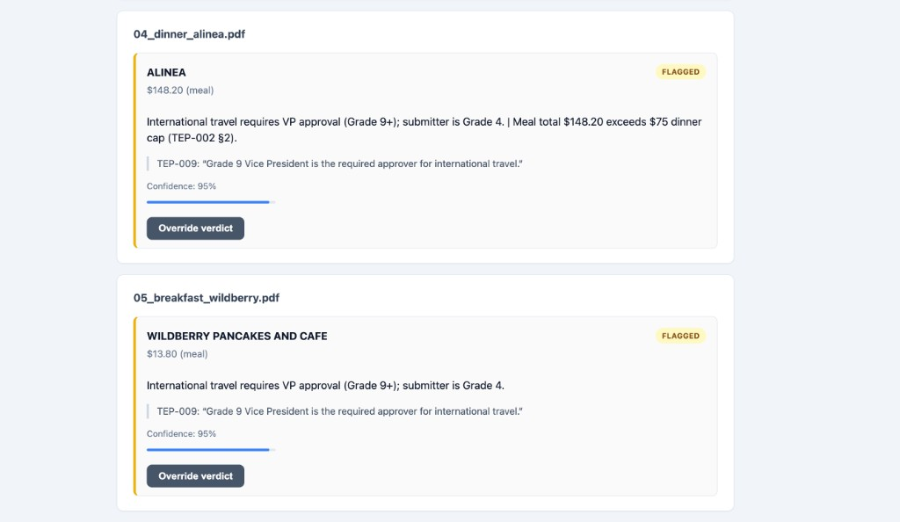

# Northwind Logistics — AI Expense Pre-Review

AI-assisted expense pre-review for finance reviewers: ingest receipts and trip context, surface per-line compliance verdicts with cited policy quotes, support human overrides, and answer ad-hoc policy questions with **grounded citations** (or refusal when out of scope). **Humans always make the final decision.**

**Live URL:** _Deploy to Railway/Render — see [PLAN.md](PLAN.md)_

**Implementation plan:** [PLAN.md](PLAN.md)

---

## How to run locally

### Prerequisites

- **Docker & Docker Compose** (recommended)
- **One LLM API key** for your chosen provider (see below)
- Python 3.11+ (optional, for `eval/` without Docker)
- Unstructured API key (optional; PyMuPDF parses bundled PDFs if unset)

### LLM providers (reviewer setup)

The review pipeline uses a **LangGraph multi-agent** flow (classifier + several policy agents per receipt). That means **multiple LLM calls per submission**, so **paid models are strongly recommended** for reliable testing. Free OpenRouter models are supported as a default but often hit rate limits (429).

**Default: `LLM_PROVIDER=auto`** — set **one** API key and start the app. Models are preconfigured per provider.

```env
LLM_PROVIDER=auto
GOOGLE_API_KEY=...          # only this key → Gemini 2.5 / 3.5 Flash
UNSTRUCTURED_API_KEY=...    # optional
```

| Key you set | Auto provider | Chat models (primary → fallback) |
|-------------|---------------|----------------------------------|
| `OPENROUTER_API_KEY` | openrouter | Kimi → DeepSeek → Nemotron (free) |
| `OPENAI_API_KEY` | openai | `gpt-4o-mini` → `gpt-4o` |
| `GOOGLE_API_KEY` | google | `gemini-2.5-flash` → `gemini-3.5-flash` |
| `ANTHROPIC_API_KEY` | anthropic | Haiku → Sonnet |
| `NVIDIA_API_KEY` | nvidia | Nemotron nano → Llama 3.1 8B |

Multiple keys set? Priority: Anthropic → OpenAI → Google → NVIDIA → OpenRouter. Force one with `LLM_PROVIDER=google` (etc.).

**Policy Q&A embeddings:** **Local CPU only** — [`all-MiniLM-L6-v2`](https://huggingface.co/sentence-transformers/all-MiniLM-L6-v2) via `sentence-transformers` (384-dim). Same model for every chat provider; **no embedding API key**. First index run downloads ~80MB weights. Override with `LOCAL_EMBEDDING_MODEL` if needed.

### Quick start (Docker — evaluation team)

```bash
cp .env.example .env
# Fill ONE LLM API key + optional UNSTRUCTURED_API_KEY

docker compose up --build
```

### Reset existing records (SQLite + Weaviate)

If you want a clean slate (delete all prior submissions, overrides, uploaded receipts, and policy vector index):

```bash
docker compose down -v
docker compose up --build -d
```

This removes Docker volumes:
- `api_storage` (SQLite DB + uploaded receipt artifacts)
- `weaviate_data` (PolicyChunk collection / BM25+vector index)

| Service | URL |
|---------|-----|
| Web UI | http://localhost:3000 |
| API | http://localhost:8000 |
| API docs | http://localhost:8000/docs |
| Weaviate (internal) | http://localhost:8080 |

**No Postgres URL, no cloud DB signup.** Policies and sample receipts are mounted from `./policies` and `./submissions` in the image. On first startup the API seeds employees, builds the policy vector index in **Weaviate**, and persists submissions in a local **SQLite** file under `storage/`.

### Local Python venv (backend / eval)

```bash
cd backend
python3 -m venv .venv
source .venv/bin/activate   # Windows: .venv\Scripts\activate
pip install -r requirements.txt
```

#### Before you run the eval harness

`python eval/run_eval.py` does **not** start the web app. It runs the **review pipeline offline** against receipt files on disk. Set this up first:

| Step | What to do |
|------|------------|
| 1 | Copy `.env.example` → `.env` and set **at least one LLM API key** (same as Docker). Eval calls the real LLM — **no mock mode**. |
| 2 | Install backend deps (`pip install -r requirements.txt` in `backend/`). |
| 3 | Ensure receipt PDFs exist under `submissions/` (bundled in the repo). The JSON fixture only **points** to them; it does not embed files. |
| 4 | From **repo root**, set `PYTHONPATH=backend`. |

**Fixture file:** The script defaults to `eval/fixtures/smoke.json` (4 cases). You can pass another manifest:

```bash
export PYTHONPATH=backend
python eval/run_eval.py                                          # default: eval/fixtures/smoke.json
python eval/run_eval.py --fixture eval/fixtures/denver.json      # all 8 receipts in 01_clean_denver
python eval/run_eval.py --fixture path/to/grader.json --submissions path/to/their/submissions
```

If `--fixture` points to a missing file, the run fails immediately. If a case references a missing receipt path, that case reports `"error": "Missing ..."` and `pass: false`.

Output is JSON on stdout (`passed`, `total`, `results[]`). Exit code `0` only if every case passes. See [Evaluation harness](#evaluation-harness) for the schema.

### Environment variables

| Variable | Required | Description |
|----------|----------|-------------|
| `LLM_PROVIDER` | No | `auto` (default) or force `openrouter` / `openai` / `google` / … |
| `OPENROUTER_API_KEY` | If OpenRouter | OpenRouter key |
| `OPENAI_API_KEY` | If OpenAI | OpenAI key |
| `ANTHROPIC_API_KEY` | If Anthropic | Anthropic key |
| `GOOGLE_API_KEY` | If Google | Google AI Studio key |
| `NVIDIA_API_KEY` | If NVIDIA | [NVIDIA NIM](https://build.nvidia.com/) API key |
| `*_MODEL` / `*_MODEL_FALLBACK` | No | Override primary/secondary per provider (see `.env.example`) |
| `LOCAL_EMBEDDING_MODEL` | No | Default `all-MiniLM-L6-v2` (CPU, 384-dim vectors for Weaviate) |
| `DATABASE_URL` | No | Default `sqlite:///./storage/northwind.db` (Compose overrides) |
| `WEAVIATE_URL` | No | Default `http://localhost:8080` (Compose uses `http://weaviate:8080`) |
| `UNSTRUCTURED_API_KEY` | Recommended | PDF/image/text partitioning |
| `UNSTRUCTURED_API_URL` | No | Default `https://api.unstructuredapp.io` |
| `POLICY_RAG_TOP_K` | No | Retrieved chunks for Q&A (default 5) |
| `POLICY_RAG_SEARCH_MODE` | No | `hybrid` (BM25+vector) or `vector` |
| `POLICY_RAG_HYBRID_ALPHA` | No | Fusion weight: 0=BM25, 1=vector (default 0.5) |
| `POLICY_RAG_MIN_SCORE` | No | Min normalized score to answer (default 0.72) |
| `POLICY_RAG_REFUSE_SCORE` | No | Below this → refuse (default 0.45) |
| `POLICIES_PATH` | No | Policy PDF directory |
| `SUBMISSIONS_PATH` | No | Sample submissions |
| `STORAGE_PATH` | No | Uploaded receipt storage |
| `REVIEW_MAX_CONCURRENCY` | No | Max parallel receipt extractions + policy LLM calls (default `4`) |

**Demo screenshots:** [end of README](#demo-screenshots) (files in [`results/`](results/)).

---

## Design story — how the architecture evolved

### 1. Where I started

My first sketch was the simplest applied-AI shape: **embed all policy PDFs, retrieve chunks per receipt, one LLM call** → verdict + quote. That is fast to prototype and looks like “RAG solves expense review.”

**Trade-off I hit immediately:** dollar caps, grade ladders, and “solo alcohol = reject” are **exact rules**. They do not belong in embedding space alone — retrieval can miss the right §, and the model can sound confident while citing the wrong clause. The brief also punishes that behavior.

### 2. What I changed (and why)

I moved to a **hybrid** design:

- **Hand-authored `policy_rules/*.json`** + deterministic `check_type` handlers for thresholds (TEP-002 meal caps, TEP-004 lodging tiers, TEP-009 grade gates, etc.).
- A **full specialist agent fleet** (~14 TEP + SEC-301) but a **classifier router** that invokes only **2–6 agents per receipt**, not all 14 every time.
- **Separate Policy Q&A RAG** (Weaviate hybrid search) for ad-hoc questions — not the same path as line-item verdicts.

**Problem this fixed:** irrelevant agents flagging clean receipts; unreliable cap enforcement; one blob of reasoning that finance cannot audit per policy.

**Why it is better:** each receipt gets **traceable** outcomes (“TEP-003 rejected solo alcohol”) with **code-first** rules for numbers and **LLM** only where judgment/language is needed.

### 3. Receipt extraction — text first, not vision everywhere

**Initial idea:** vision LLM on every upload.  
**Trade-off:** cost and latency at scale; most bundled PDFs already have a text layer.  
**What I ship:** Unstructured API (or PyMuPDF fallback) → plain text → **one LLM call that returns schema-constrained JSON** (`ExtractedReceipt`). Vision stays a **future** fallback when confidence is low.

### 4. Orchestration and timeouts

**Problem:** sequential review of 6+ receipts × several agents → **504 gateway timeouts**.  
**Change:** `review_line_item_async` — classify once, `asyncio.gather` on policy agents; parallel receipts capped by `REVIEW_MAX_CONCURRENCY`. LangGraph (`review_graph.py`) remains as a reference graph; the live `/review` endpoint uses the async path.

### 5. Why SQLite and Weaviate locally (not Postgres + pgvector on day one)

I split persistence into **two jobs** on purpose:

| Job | Store | Why not one database? |
|-----|--------|-------------------------|
| **Transactional data** — employees, submissions, line items, verdicts, overrides (must survive restart, ACID, auditable) | **SQLite** file in `storage/` | Zero setup for graders: `docker compose up`, no cloud DB account. Case-study volume is small (dozens of receipts, not millions of rows). SQLAlchemy makes a later **RDS Postgres** swap localized. |
| **Policy search** — chunk embeddings + BM25 for Policy Q&A only | **Weaviate** in Docker | Vector + hybrid keyword search is Weaviate’s strength. I do **not** store submissions or verdicts there. Mixing vectors into SQLite would mean extensions/migrations graders do not need for a demo. |

**Trade-off accepted:** SQLite is not HA for 10k submissions/day; single-node Weaviate is not production-grade HA. That is fine for this submission. **Production** → RDS for relational data, **Pinecone or managed Weaviate** for the policy index (see [Scaling](#scaling-to-10000-submissionsday)).

**Embeddings:** local **`all-MiniLM-L6-v2`** (384-dim) so evaluators need **no embedding API key**; chat LLM provider stays independent.

### 6. UX and honesty

- **One line item per receipt** — matches the brief’s sample folders (`submissions/*/receipts/`).
- **Verdict-first UI** — no dev pipeline log in the reviewer view.
- **`needs_review` and Q&A refusal** when evidence is weak — prefer honest uncertainty over a wrong confident answer.

---

## Tradeoffs (how I decide)

### Flagged vs rejected vs needs_review

| Verdict | When I use it |
|---------|----------------|
| **compliant** | All invoked agents pass (or only non-applicable) |
| **flagged** | Policy violation or threshold breach that may be fixable or needs manager judgment (e.g. meal over cap, missing Concur booking) |
| **rejected** | Hard policy block (e.g. solo alcohol per TEP-003) |
| **needs_review** | Weak extraction, unverified citation, or agent disagreement — honest “not sure” |

Aggregation picks the **worst** applicable status (`rejected` > `flagged` > `needs_review` > `compliant`). Submission-level rules (TEP-001 / TEP-009 totals) can elevate a receipt verdict after per-receipt review.

### Citation faithfulness

`aggregate_results()` runs `validate_quote()` against `policy_rules/{doc_id}.json`. If the quoted clause cannot be matched, status is downgraded to **`needs_review`** rather than presenting a false citation.

### Retrieval (Policy Q&A)

- **Hybrid BM25 + vector** — policy IDs and § refs favor BM25; paraphrases favor vectors.
- **Refuse** when score &lt; `POLICY_RAG_REFUSE_SCORE`, HR/off-topic keywords, or LLM sets `refused: true`.
- **Future:** cross-encoder **reranker** on top-k chunks before the answer LLM (see [Future scope](#future-scope-beyond-this-coding-challenge)).

### Vision vs OCR

I do **not** call a vision model on every receipt today. Text partition + JSON extraction is the default. A production upgrade would add vision only when `extraction_confidence` or `ocr_confidence` is below threshold.

---

## Cost

### Today (case study / local demo)

| Component | Cost |
|-----------|------|
| SQLite, Weaviate (Docker), local embeddings | **$0** infra |
| LLM (review + Q&A) | Depends on your key; free OpenRouter tiers possible but **rate-limited** — paid tier recommended for multi-receipt demos |
| Unstructured API | Optional; PyMuPDF handles most bundled PDFs without it |

**Rough variable cost per submission** (paid mini model, ~6 receipts, ~4 agents/receipt after routing):

- ~1 extract + 1 route + ~4 agents ≈ **30–40 LLM calls** per submission  
- At ~$0.001–0.003/call (mini-class): **~$0.03–0.12/submission** order of magnitude (model-dependent)

Parallelism (`REVIEW_MAX_CONCURRENCY`) reduces **wall-clock time**, not token count.

### Production (Northwind-scale)

| Layer | Direction | Why cost appears |
|-------|-----------|------------------|
| **LLM** | Paid models + caching repeated policy prompts | Volume |
| **Relational DB** | **AWS RDS** (or similar) Postgres | HA, backups, employee/submission/override audit at scale — replaces SQLite |
| **Vector DB** | **Pinecone** / managed Weaviate / OpenSearch | HA, multi-AZ, ops off your plate — replaces single-node Weaviate |
| **Object storage** | S3 for receipt PDFs/images | Durable uploads |
| **Compute** | API autoscaling + **job queue** (SQS + workers) for `/review` | Decouple long review from HTTP; absorb 10k/day spikes |
| **Reranker** | Small cross-encoder or hosted rerank API | Better Q&A precision; extra $/query |
| **Unstructured** | Cloud partition for scans/images | Higher quality OCR |

---

## Scaling to ~10,000 submissions/day

Today’s stack is optimized for **evaluators cloning the repo**. At ~10k submissions/day (~40k–80k receipts/day if ~4–8 receipts each):

| Concern | Approach |
|---------|----------|
| **HTTP timeouts** | Already mitigated: parallel receipts + agents (`review_line_item_async`, nginx 600s). Production: **async jobs** — `POST /review` enqueues work, UI polls status |
| **API throughput** | Horizontally scale stateless FastAPI behind a load balancer |
| **Review workers** | Dedicated worker pool; `REVIEW_MAX_CONCURRENCY` per worker; global cap on LLM RPM |
| **Database** | **Postgres on RDS** (multi-AZ); connection pooling (PgBouncer); indexes on `submission_id`, `employee_id`, `created_at` |
| **Vectors** | **Managed vector DB** (e.g. Pinecone) with replicated index; policy index updates via CI job |
| **Receipt storage** | S3 + pre-signed uploads; virus scan hook |
| **Caching** | Cache policy JSON loads; optional Redis for session/rate limits |
| **Deterministic first** | Keep cap/tier checks in code — fewer LLM calls under load |
| **Observability** | Per-stage latency, LLM token metrics, refusal rate on Q&A, override rate |

**Order of operations for scale:** (1) async review queue, (2) Postgres, (3) managed vectors + object storage, (4) reranker for Q&A, (5) vision fallback for low-confidence OCR.

---

## Supported receipt formats

The brief requires **PDF, JPG/PNG, and TXT**. All three are supported on the **upload path** (UI + API + review pipeline).

### UI file picker

On **New submission → Upload receipts**, the control explicitly allows:

```text
accept=".pdf,.png,.jpg,.jpeg,.txt"
```

Copy on the page: *“PDF, JPG, PNG, or TXT — one line item per receipt.”* Users can select **multiple files** in one go (mixed formats allowed).

### Production / Docker behavior (same code path as local)

| Format | Upload | Review pipeline |
|--------|--------|-----------------|
| **PDF** | Yes | PyMuPDF text layer by default; **Unstructured API** when `UNSTRUCTURED_API_KEY` is set (recommended in production) |
| **Images** (`.png`, `.jpg`, `.jpeg`) | Yes | **Unstructured API** for OCR/layout — this is how production should run for scans/photos |
| **Plain text** (`.txt`) | Yes | Read file directly → LLM extraction |

So yes: in production, when a reviewer uploads any of these three types through the UI, the backend stores the file and runs the same extract → classify → agents flow. Set **`UNSTRUCTURED_API_KEY` in production** so PDFs and **images** both partition reliably (not only PDF via PyMuPDF).

**Local demo without Unstructured:** PDF and TXT work well; image uploads may parse poorly because the PyMuPDF fallback does not OCR photos.

- API: `POST /api/submissions/{id}/receipts` accepts mixed multipart uploads.
- Word/Excel/HTML are **not** in scope for v1.

---

## Future scope (beyond this coding challenge)

The brief’s six capabilities, eval harness, README, and deployable demo are in scope for **this submission**. The items below describe how I would evolve the product if Northwind adopted it after the case study.

### Near-term product hardening

- **Concur / expense-system integration** — pull submissions instead of manual upload.
- **SSO + role-based access** — finance reviewer vs employee vs admin.
- **Employee master data** — HR sync into a proper employee store (today: seeded JSON + optional `POST /api/employees`).
- **Approval workflow** — route flagged items to managers by grade (TEP-009), email/Slack notifications.
- **Audit exports** — CSV/PDF pack for compliance with overrides and policy citations.

### Accuracy & policy intelligence

- **Cross-encoder reranker** on Policy Q&A retrieval (after hybrid top-k).
- **Vision LLM fallback** only when extraction/OCR confidence is low (not on every receipt).
- **Richer international-trip detection** — structured destination fields in trip context instead of keyword heuristics in receipt text.
- **Continuous eval** — expand harness with `policy_chat` refusal cases and grader held-out JSON; CI gate on regressions.

### Platform & scale (10k+ submissions/day)

- **Async review jobs** — queue + workers so HTTP returns immediately; UI polls status.
- **AWS RDS (Postgres)** — HA transactional store for employees, submissions, verdicts, overrides.
- **Managed vector DB (e.g. Pinecone)** — HA policy index, separate from app DB.
- **S3** — durable receipt object storage with lifecycle rules.
- **Autoscaling API/workers**, rate limiting, observability (latency, token cost, refusal rate).

### Operations

- **Policy admin** — reindex API when legal updates PDFs without wiping submission data.
- **Model routing** — cheaper models for classify/extract, stronger models for edge cases.
- **Cost controls** — per-tenant budgets, caching of repeated policy prompts.

---

## Evaluation harness

Graders may ship a **held-out JSON fixture** after submission. I designed the harness to be **schema-tolerant**: required fields for my runner, optional fields for stricter checks if their file includes them.

### How receipts work (JSON does not embed PDFs)

The fixture file is **not** the receipt. It is a **test manifest**: expected outcomes + **pointers** to receipt files that must already exist on disk.

For each case, the runner builds a path like:

```text
{submissions_path}/{submission_folder}/receipts/{receipt_file}
```

Example from `smoke.json`:

| JSON field | Value | Resolves to |
|------------|-------|-------------|
| `submission_folder` | `03_dinner_over_cap` | `submissions/03_dinner_over_cap/` |
| `receipt_file` | `04_dinner_alinea.pdf` | `submissions/03_dinner_over_cap/receipts/04_dinner_alinea.pdf` |

Those PDFs ship in the repo under `submissions/` (same layout as the brief’s sample data). The harness **reads the file**, runs extraction + review, then compares the result to `expected_status` / `expected_policy_refs` in the JSON.


### Run locally

```bash
cp .env.example .env   # LLM key required
export PYTHONPATH=backend
python eval/run_eval.py --fixture eval/fixtures/smoke.json
```

Exit code `0` = all cases pass. Output is JSON: `passed`, `total`, `results[]`.

### Fixture format (v1 — what I implement today)

```json
{
  "schema_version": 1,
  "description": "Optional note for humans",
  "cases": [
    {
      "id": "unique_case_id",
      "type": "receipt_review",
      "submission_folder": "03_dinner_over_cap",
      "receipt_file": "04_dinner_alinea.pdf",
      "trip_context": {
        "trip_purpose": "...",
        "trip_dates": "2025-05-06 to 2025-05-07",
        "grade": 4,
        "title": "Optional — TEP-009",
        "employee_id": "Optional"
      },
      "expected_status": "flagged",
      "expected_policy_refs": ["TEP-002"],
      "forbidden_policy_refs": ["TEP-009"],
      "notes": "Optional grader comment"
    }
  ]
}
```

| Field | Required | Purpose |
|-------|----------|---------|
| `id` | Yes | Stable case name in reports |
| `submission_folder` | Yes* | Folder under `submissions/` |
| `receipt_file` | Yes* | File under `.../receipts/` |
| `trip_context` | Yes* | Passed into review (grade, purpose, dates) |
| `expected_status` | Yes* | `compliant` \| `flagged` \| `rejected` \| `needs_review` |
| `expected_policy_refs` | No | Doc ids (or `TEP-002§2`) that should appear in winning `policy_doc_id` |
| `forbidden_policy_refs` | No | **Future** — fail if these appear (e.g. wrong international flag) |
| `type` | No | Default `receipt_review`; extensibility below |

\*Required for `type: receipt_review` (default).

### Metrics (per case)

| Metric | Meaning |
|--------|---------|
| `status_match` | Verdict equals `expected_status` |
| `policy_match` | If `expected_policy_refs` set, primary policy doc matches |
| `quote_ok` | For flagged/rejected, a non-empty `policy_quote` exists |
| `pass` | All of the above |


## Policy Q&A (brief capability #6)

**Yes — PDF RAG addresses this**, not keyword-only search.

**Policy PDF upload button:** there is currently **no UI button** to upload policy PDFs.  
Policy Q&A indexes PDFs from the local `policies/` folder mounted into the API container.

To add/update policy documents:

1. Copy new files into `./policies` (e.g., `policy4.pdf`).
2. Rebuild/restart API so indexing runs from startup:

```bash
docker compose up --build -d
```

If you replaced policy PDFs and want a full fresh re-index, run:

```bash
docker compose down -v
docker compose up --build -d
```

1. **Index:** Policy PDFs under `policies/` are parsed (Unstructured API → PyMuPDF fallback), split into TEP/SEC chunks, embedded locally with **all-MiniLM-L6-v2**, stored in **Weaviate** (`doc_id`, `section`, `content` + vector).
2. **Retrieve (hybrid):** `POST /api/policy/chat` uses **Weaviate hybrid search** — **BM25** + **vector** fused with `alpha` (default `0.5`).
3. **Answer:** LLM synthesizes an answer **only from retrieved excerpts** with citations.
4. **Refuse:** Off-topic keywords (HR/payroll), low retrieval score, or missing evidence → `refused: true` (no fabrication).

Noise documents (HR, records retention) are excluded from indexing (`TEP-*`, `SEC-301` only).

### Why hybrid search (BM25 + semantic)?

| Query style | Best leg | Example |
|-------------|----------|---------|
| Policy number / code | **BM25** | “What does **TEP-005** say about business class?” |
| Section reference | **BM25** | “§3.1 alcohol solo travel” |
| Natural language | **Vector** | “Can I expense drinks alone on a trip?” |
| Mixed | **Hybrid** | “TEP-002 dinner cap with a client” |

Implementation: `backend/app/services/vector_store.py` → `search_chunks_hybrid()`.

- **BM25** indexes `doc_id`, `section`, `content` (keyword + policy id matching).
- **Vector** uses local **all-MiniLM-L6-v2** embeddings (semantic paraphrases; runs on CPU).
- **`POLICY_RAG_HYBRID_ALPHA`**: `0` = keyword only, `1` = vector only, `0.5` = balanced.
- Explicit ids in the question (e.g. `TEP-003`) are duplicated into the BM25 query for stronger id match.
- **`POLICY_RAG_SEARCH_MODE`**: `hybrid` (default) or `vector` (semantic-only fallback).

Scores are min–max normalized within the top-k set before threshold checks (`POLICY_RAG_MIN_SCORE`, `POLICY_RAG_REFUSE_SCORE`).

### Embeddings (local, unified)

| Item | Value |
|------|--------|
| Model | `sentence-transformers/all-MiniLM-L6-v2` (default `LOCAL_EMBEDDING_MODEL=all-MiniLM-L6-v2`) |
| Runtime | CPU (`device=cpu`); ~22M parameters, fast on laptops |
| Vector size | **384** (Weaviate `PolicyChunk` collection) |
| Chat LLM | **Independent** — use Google, OpenAI, Anthropic, etc. for review/Q&A answers; embeddings never call provider APIs |

Implementation: `backend/app/llm/embeddings.py` → used by `policy_indexer.py` and hybrid search in `vector_store.py`.

**Migrating from an older API-based index (1536-dim):** On startup, if stored vectors are not 384-dim, the API rebuilds the policy index automatically. Or run `docker compose down -v` and `docker compose up --build` to reset Weaviate.

---

## Architecture

### Why SQLite + Weaviate (local-first)

See [Design story — §5 Why SQLite and Weaviate](#design-story--how-the-architecture-evolved) for the full reasoning. Short version:

- **SQLite** = submissions, verdicts, overrides (relational, auditable, survives restart).
- **Weaviate** = policy PDF chunks only (hybrid BM25 + vector for Q&A).
- **Not** using Postgres/pgvector here avoids extra signup and ops for graders; data size does not justify it yet.

| Layer | Choice | Rationale |
|-------|--------|-----------|
| **Transactional data** | SQLite file (`storage/northwind.db`) | Zero install; one file per environment; enough for submissions, verdicts, overrides |
| **Policy vectors** | Weaviate in Docker | Purpose-built ANN + BM25 hybrid; no vector extensions in SQLite |
| **Bundled assets** | `policies/`, `submissions/` mounted read-only | Evaluators clone repo → `docker compose up` — no asset URLs |
| **LLM** | Provider-agnostic (`LLM_PROVIDER=auto`) | One API key; models preconfigured per provider |

**When to upgrade:** Production at Northwind scale (10k+ submissions/day) → **RDS Postgres** + **managed vector DB (e.g. Pinecone)**; boundaries are `SQLAlchemy` + `vector_store.py`.

### System overview



### Review pipeline (per receipt)

**Production path** (`POST /api/submissions/{id}/review`): parallel receipts + `review_line_item_async` in `graph/review_workflow.py`.

**Reference path** (eval / LangGraph): `backend/app/graph/review_graph.py` — same stages, LangGraph `Send` for agent fan-out.

| Step | What | Where |
|------|------|--------|
| 1 | User uploads receipt (PDF/image/txt) | `routers/submissions.py` |
| 2 | Partition → plain text | `services/unstructured_io.py` (PyMuPDF fallback) |
| 3 | LLM → structured receipt JSON | `services/receipt_extractor.py` (parallel across receipts) |
| 4 | **Classifier** — LLM + `policy_registry.json` → `policy_ids` | `services/policy_router.py` |
| 5 | **Policy agents (parallel)** — deterministic rules first, then LLM | `services/policy_agent.py` (`asyncio.gather`, capped by `REVIEW_MAX_CONCURRENCY`) |
| 6 | **Aggregate** — worst status, citation check | `graph/aggregation.py` |



Policy Q&A uses a **separate** Weaviate RAG path (`policy_chat.py`), not the review graph.


### Policy rules coverage

All expense policies have JSON rule files with deterministic `check_type` handlers:

| Policy | Deterministic checks (examples) |
|--------|----------------------------------|
| TEP-001 | Trip purpose, grade approval thresholds |
| TEP-002 | Meal caps (breakfast/lunch/dinner) |
| TEP-003 | Alcohol solo / amount caps |
| TEP-004 | Lodging tier caps, Concur booking |
| TEP-005 | Flight class / duration |
| TEP-006 | Keyword flags (personal items) |
| TEP-007 | Itemization, amount consistency, extraction confidence |
| TEP-008 | Per-diem keywords |
| TEP-009 | Grade / approval thresholds |
| TEP-010 | Corporate card keywords |
| TEP-012 | Client entertainment caps |
| TEP-013 | International approval |
| TEP-014 | Conference documentation |
| SEC-301 | Sanctions / high-risk destinations |

---

## Repository layout

```
case_study/
├── README.md
├── PLAN.md
├── .env.example
├── policies/              # Policy PDF bundles
├── submissions/           # Sample employees + receipts
├── docker-compose.yml     # api + frontend + weaviate (no Postgres)
├── backend/
│   ├── .venv/             # Local virtualenv (gitignored)
│   ├── storage/           # SQLite DB + uploads (gitignored, Docker volume)
│   ├── app/
│   │   ├── policy_rules/  # TEP-001..014, SEC-301 JSON
│   │   ├── services/      # router, agents, extraction, vector_store
│   │   └── graph/         # LangGraph: review_graph.py, state, aggregation
│   └── requirements.txt
├── frontend/
├── eval/
│   ├── run_eval.py
│   └── fixtures/smoke.json, denver.json
└── results/               # UI screenshots for demo / write-up
```

---

## License

TBD (case study submission).

---

## Demo screenshots

UI examples from a local run (`docker compose up`). Screenshots live in [`results/`](results/).

### Submission history



### Policy Q&A — dinner cap



### Flagged receipts — TEP-009 (international)



### Compliant submission — flight (James Walker)



### Flagged receipt — Lyft (TEP-009)



### Submission flagged — Priya Patel trip



### Flagged receipts — TEP-002 (meal cap)


